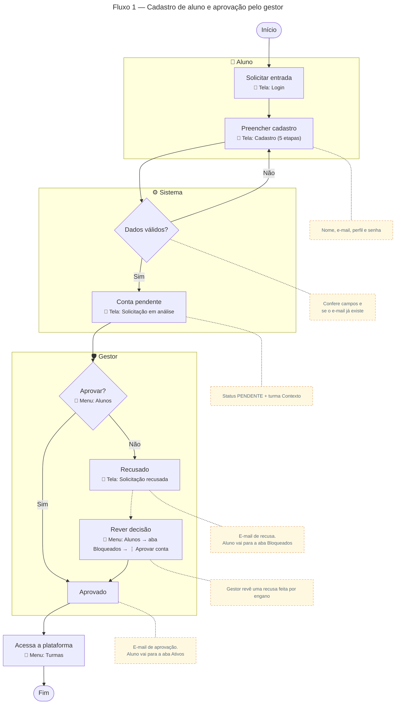

# Cadastro de aluno → aprovação pelo gestor

Para gerar a imagem, cole o bloco em [mermaid.live](https://mermaid.live) e exporte em PNG/SVG.

## Descrição do fluxo

1. **Solicitar entrada** (tela de Login): o aluno clica em "Solicitar entrada".
2. **Preencher cadastro** (tela de Cadastro, 5 etapas): o aluno informa nome, e-mail, dados do perfil e senha.
3. **Dados válidos?** O sistema confere os campos e se o e-mail já está em uso. Se houver erro, o aluno volta ao formulário.
4. **Conta pendente** (tela "Solicitação em análise"): o sistema cria a conta com status PENDENTE e matricula o aluno na turma Contexto. Até a aprovação, todo login leva a essa tela.
5. **Aprovar?** (menu Alunos): o gestor analisa a solicitação no card "Aprovações pendentes".
6. **Aprovado:** o status muda para APROVADO, o aluno recebe um e-mail de aprovação e passa a aparecer na aba **Ativos** da tela Alunos.
7. **Recusado** (tela "Solicitação recusada"): o status muda para RECUSADO, o aluno recebe um e-mail de recusa e passa a aparecer na aba **Bloqueados**. No login, ele vê a tela de recusa, com orientação para procurar a coordenação.
8. **Rever decisão** (menu Alunos → aba Bloqueados → ⋮ → "Aprovar conta"): se a recusa foi um engano, o gestor aprova a conta. O aluno vai para a aba Ativos e recebe o e-mail de aprovação.
9. **Acessa a plataforma** (menu Turmas): com a conta aprovada, o aluno entra e acessa turmas, glossário e favoritos.

## Bloqueio de alunos já ativos

Fora do fluxo de cadastro, o gestor pode bloquear um aluno ativo (menu Alunos → aba Ativos → ⋮ → "Bloquear aluno"). A conta fica inativa, o aluno não consegue mais fazer login e vai para a aba Bloqueados. Para liberar de novo, o gestor usa "Desbloquear aluno" na mesma aba.
