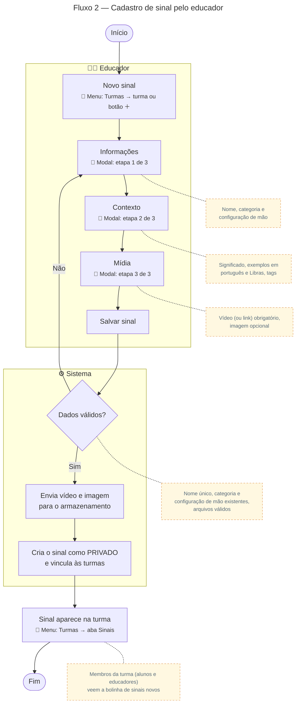

# Cadastro de sinal

Para gerar a imagem, cole o bloco em [mermaid.live](https://mermaid.live) e exporte em PNG/SVG.

## Descrição do fluxo

1. **Novo sinal** (menu Turmas): o educador abre a turma, ou usa o botão ＋, e escolhe criar um sinal.
2. **Informações** (modal, etapa 1 de 3): informa o nome do sinal, a categoria e escolhe a configuração de mão no teclado visual.
3. **Contexto** (modal, etapa 2 de 3): descreve o significado e o movimento, os exemplos em português e em Libras, e as tags.
4. **Mídia** (modal, etapa 3 de 3): envia o vídeo do sinal ou informa um link alternativo (ex.: YouTube). A imagem ilustrativa é opcional.
5. **Dados válidos?** O sistema confere se o nome ainda não existe, se a categoria, a configuração de mão e as turmas existem, se há vídeo ou link e se os arquivos são realmente vídeo/imagem. Se algo falhar, o educador corrige no formulário.
6. **Armazenamento:** o vídeo e a imagem são enviados para o armazenamento em nuvem (Cloudflare R2).
7. **Criação:** o sinal é salvo com status PRIVADO, ou seja, visível só nas turmas em que foi vinculado.
8. **Sinal na turma** (menu Turmas → aba Sinais): o sinal aparece na lista da turma, e os demais membros (alunos e educadores) veem a bolinha de "sinais novos" no card da turma. Quem criou o sinal não conta como novidade para si mesmo.

> Todo sinal tem obrigatoriamente **vídeo (ou link) + configuração de mão**. Para ficar visível a toda a instituição, o sinal passa pelo [Fluxo 3 — Promoção ao Glossário Global](03-promocao-glossario.md).
