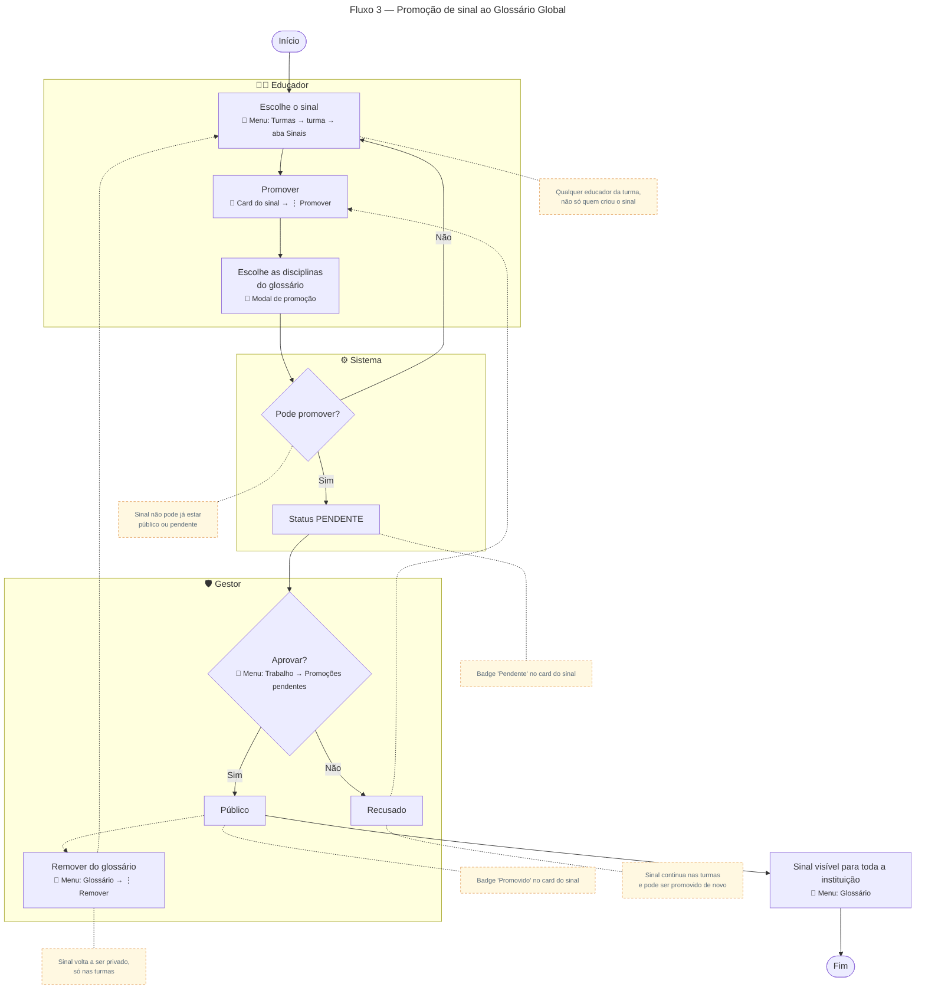

# Promoção de sinal ao Glossário Global

Para gerar a imagem, cole o bloco em [mermaid.live](https://mermaid.live) e exporte em PNG/SVG.

## Descrição do fluxo

1. **Escolhe o sinal** (menu Turmas → turma → aba Sinais): qualquer educador pode pedir a promoção de um sinal, não só quem o criou. Isso permite que um educador indique ao glossário um bom sinal cadastrado por outro colega.
2. **Promover** (card do sinal → ⋮ → "Promover"): o educador pede que o sinal entre no Glossário Global.
3. **Disciplinas do glossário** (modal de promoção): escolhe, nos cards, em quais disciplinas do glossário o sinal vai aparecer (nenhuma, uma ou várias).
4. **Pode promover?** O sistema confere se quem pediu é educador (ou gestor) e se o sinal ainda não está público nem aguardando aprovação. Alunos não podem pedir promoção.
5. **Pendente:** o sinal fica com status PENDENTE e entra na fila do gestor. O card mostra o selo "Pendente".
6. **Aprovar?** (menu Trabalho → Promoções pendentes): o gestor revisa o sinal.
7. **Público:** se aprovado, o sinal fica PÚBLICO e aparece no Glossário Global para toda a instituição. O card mostra o selo "Promovido".
8. **Recusado:** se recusado, o sinal fica RECUSADO, continua nas turmas e qualquer educador pode promovê-lo de novo depois de ajustar.
9. **Remover do glossário** (menu Glossário → ⋮ → "Remover do glossário"): a qualquer momento, o gestor pode tirar um sinal público do glossário. Ele volta a ser privado, visível só nas turmas, e pode ser promovido de novo.

> A promoção não tira o sinal das turmas: ele continua onde estava e, quando público, também passa a aparecer no Glossário Global. O sinal nasce no [Fluxo 2 — Cadastro de sinal](02-cadastro-sinal.md).
