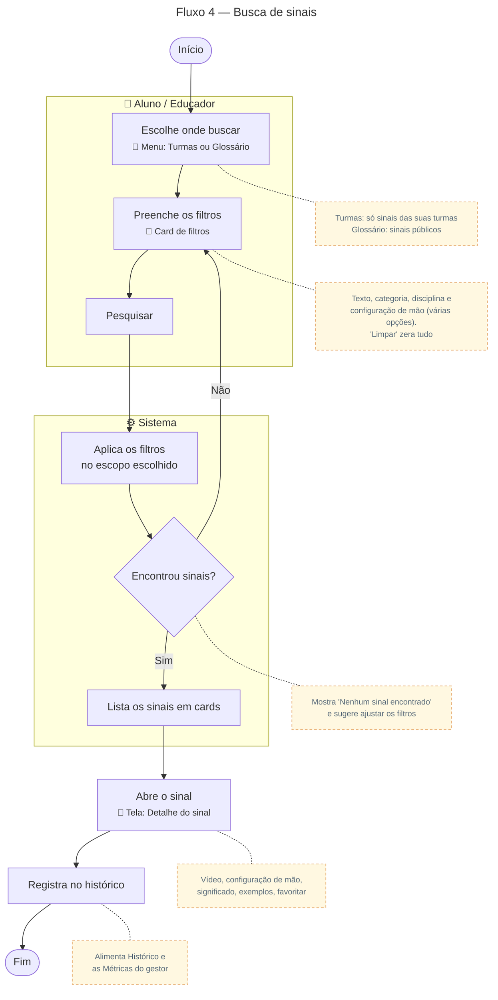

# Busca de sinais

Para gerar a imagem, cole o bloco em [mermaid.live](https://mermaid.live) e exporte em PNG/SVG.

## Descrição do fluxo

1. **Escolhe onde buscar** (menu Turmas ou Glossário): a busca é contextualizada. Em Turmas, o usuário encontra só os sinais das turmas de que participa; no Glossário, os sinais públicos de toda a instituição.
2. **Preenche os filtros** (card de filtros): pode combinar busca por texto (nome do sinal), categoria, disciplina e configuração de mão pelo teclado visual. Cada filtro aceita várias opções ao mesmo tempo. O botão "Limpar" zera todos.
3. **Pesquisar:** os filtros só são aplicados ao clicar em "Pesquisar".
4. **Encontrou sinais?** O sistema filtra os sinais do escopo escolhido. Se nada for encontrado, mostra "Nenhum sinal encontrado" e o usuário ajusta os filtros.
5. **Lista em cards:** os resultados aparecem como cards; passar o mouse sobre um card reproduz o vídeo.
6. **Abre o sinal** (tela de detalhe): mostra o vídeo, a configuração de mão, o significado, os exemplos em português e Libras, e permite favoritar.
7. **Registra no histórico:** cada abertura entra no histórico do usuário e nas métricas de uso vistas pelo gestor.
