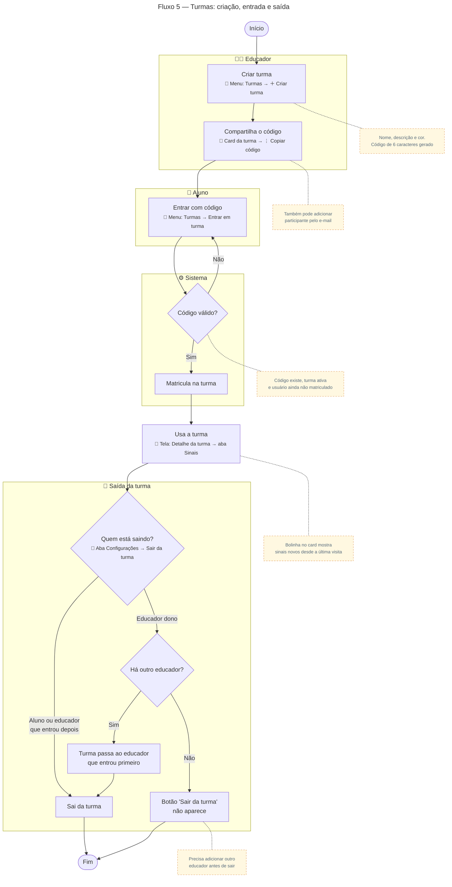

# Turmas: criação, entrada e saída

Para gerar a imagem, cole o bloco em [mermaid.live](https://mermaid.live) e exporte em PNG/SVG.

## Descrição do fluxo

1. **Criar turma** (menu Turmas → ＋): o educador informa nome, descrição e cor do card. O sistema gera um código de convite de 6 caracteres.
2. **Compartilha o código** (card da turma → ⋮ → "Copiar código"): o educador passa o código aos alunos. Ele também pode adicionar alguém direto pelo e-mail, na aba Configurações da turma.
3. **Entrar com código** (menu Turmas → "Entrar em turma"): o aluno digita o código.
4. **Código válido?** O sistema confere se o código existe, se a turma está ativa e se o aluno ainda não está matriculado. Se algo falhar, mostra o erro e o aluno tenta de novo.
5. **Matricula na turma:** a turma passa a aparecer na lista do aluno.
6. **Usa a turma** (detalhe da turma → aba Sinais): o aluno vê os sinais da turma, favorita e busca. No card da turma, uma bolinha mostra quantos sinais novos entraram desde a última visita (vale para alunos e educadores).
7. **Saída da turma** (aba Configurações → "Sair da turma"):
   - **Aluno** sai quando quiser.
   - **Educador que entrou depois** do criador também sai livremente.
   - **Educador dono** só sai se houver outro educador na turma. Nesse caso, a turma passa para o educador que entrou primeiro depois dele.
   - Se o dono for o **único educador**, o botão "Sair da turma" nem aparece. Ele precisa adicionar outro educador antes de sair.

> Todos os alunos e educadores também são matriculados automaticamente na turma **Contexto** ao criar a conta (ver [Fluxo 1](01-cadastro-aprovacao-aluno.md)).
