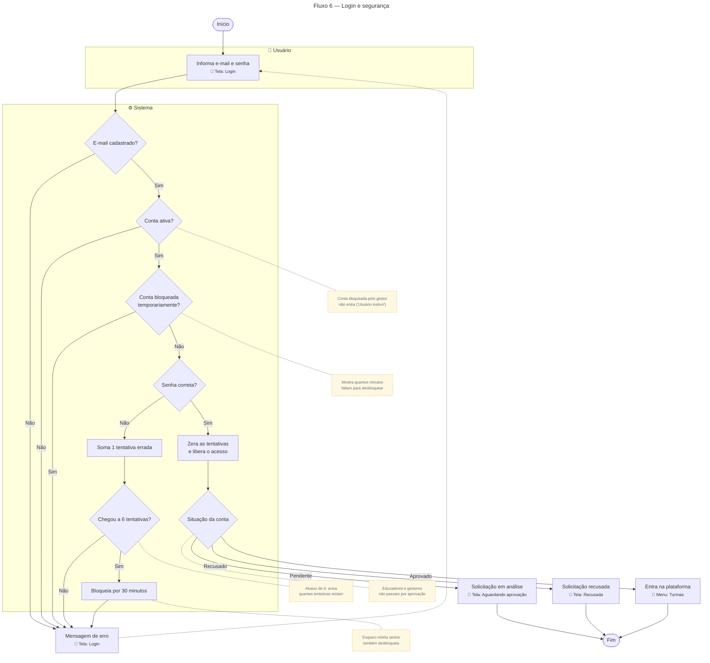

# Login e segurança

Para gerar a imagem, cole o bloco em [mermaid.live](https://mermaid.live) e exporte em PNG/SVG.

## Descrição do fluxo

1. **Informa e-mail e senha** (tela de Login).
2. **E-mail cadastrado?** Se não existir, o sistema mostra uma mensagem de erro.
3. **Conta ativa?** Uma conta bloqueada pelo gestor (menu Alunos → "Bloquear aluno") não consegue entrar e recebe "Usuário inativo".
4. **Conta bloqueada temporariamente?** Se a conta estiver no período de bloqueio por tentativas, o sistema informa quantos minutos faltam.
5. **Senha correta?**
   - **Errada:** soma uma tentativa errada e avisa quantas restam. Na **6ª tentativa errada**, a conta fica bloqueada por **30 minutos**.
   - **Certa:** zera o contador de tentativas e libera o acesso.
6. **Situação da conta:** antes de mostrar a plataforma, o sistema confere a aprovação (só para alunos; educadores e gestores não passam por aprovação):
   - **Pendente** → tela "Solicitação em análise".
   - **Recusado** → tela "Solicitação recusada".
   - **Aprovado** → entra na plataforma, no menu Turmas.

> Redefinir a senha por "Esqueci minha senha" também desfaz o bloqueio por tentativas. O fluxo de aprovação está no [Fluxo 1](01-cadastro-aprovacao-aluno.md).
