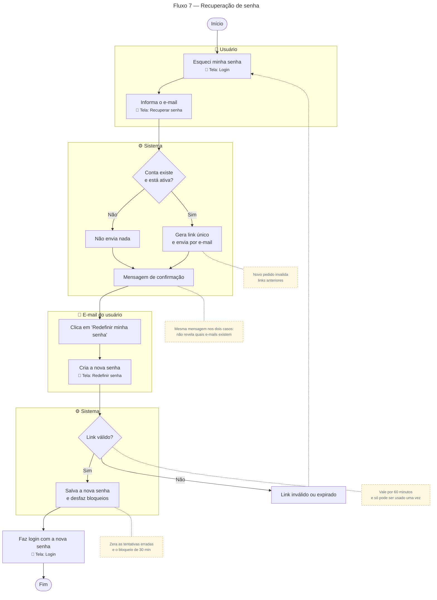

# Recuperação de senha

Para gerar a imagem, cole o bloco em [mermaid.live](https://mermaid.live) e exporte em PNG/SVG.

## Descrição do fluxo

1. **Esqueci minha senha** (tela de Login): o usuário clica no link abaixo do formulário.
2. **Informa o e-mail** (tela Recuperar senha).
3. **Conta existe e está ativa?**
   - **Sim:** o sistema gera um link único e envia por e-mail. Um novo pedido invalida os links anteriores que ainda não foram usados.
   - **Não:** nada é enviado.
4. **Mensagem de confirmação:** a resposta é a mesma nos dois casos. Isso evita que alguém descubra quais e-mails estão cadastrados na plataforma.
5. **Clica em "Redefinir minha senha"** (e-mail): o botão abre a tela Redefinir senha.
6. **Cria a nova senha** (tela Redefinir senha): o usuário digita e confirma a nova senha.
7. **Link válido?** O link vale por **60 minutos** e só pode ser usado **uma vez**. Se estiver expirado ou já usado, o sistema avisa e o usuário pede um novo e-mail.
8. **Salva a nova senha:** a senha é guardada criptografada, e o sistema zera as tentativas erradas e o bloqueio temporário de login (ver [Fluxo 6](06-login-seguranca.md)).
9. **Faz login com a nova senha** (tela de Login).
