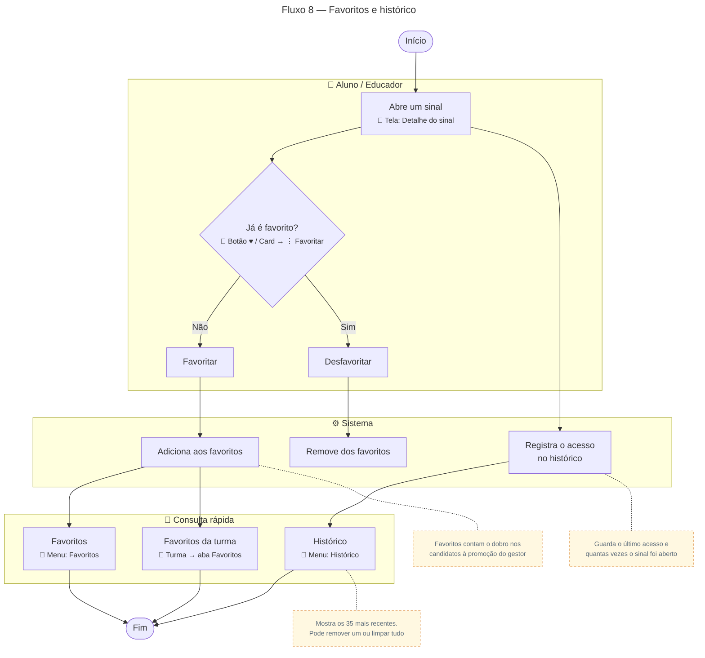

# Favoritos e histórico

Para gerar a imagem, cole o bloco em [mermaid.live](https://mermaid.live) e exporte em PNG/SVG.

## Descrição do fluxo

1. **Abre um sinal** (tela de detalhe): ao abrir, o sistema **registra o acesso no histórico**, guardando a data do último acesso e quantas vezes o usuário abriu aquele sinal.
2. **Já é favorito?** O usuário favorita ou desfavorita pelo botão ♥ no detalhe do sinal ou pelo menu ⋮ do card.
   - **Favoritar:** o sinal entra na lista de favoritos.
   - **Desfavoritar:** o sinal sai da lista.
3. **Consulta rápida:**
   - **Favoritos** (menu Favoritos): todos os sinais favoritados pelo usuário.
   - **Favoritos da turma** (turma → aba Favoritos): só os favoritos daquela turma.
   - **Histórico** (menu Histórico): os 35 sinais acessados mais recentemente. O usuário pode remover um item ou limpar todo o histórico.

> Os acessos e favoritos também alimentam a página **Métricas** do gestor: os sinais mais acessados e os candidatos à promoção, em que cada favorito vale o dobro de um acesso (ver [Fluxo 3](03-promocao-glossario.md)).
