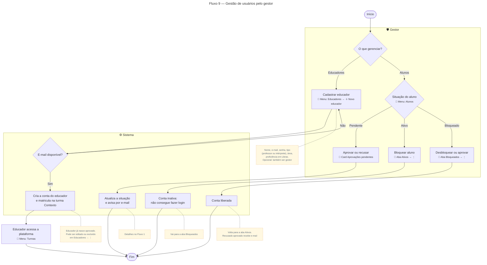

# Gestão de usuários pelo gestor

Para gerar a imagem, cole o bloco em [mermaid.live](https://mermaid.live) e exporte em PNG/SVG.

## Descrição do fluxo

1. **O que gerenciar?** O gestor escolhe entre o menu **Educadores** e o menu **Alunos**.

**Educadores**

2. **Cadastrar educador** (Educadores → ＋ Novo educador): o gestor informa nome, e-mail, senha, tipo (professor ou intérprete), área de atuação e proficiência em Libras. Pode marcar que o educador também será **gestor**.
3. **E-mail disponível?** Se o e-mail já estiver em uso, o gestor corrige o cadastro.
4. **Cria a conta:** o educador já nasce aprovado (educadores não passam pela fila de aprovação) e é matriculado automaticamente na turma Contexto.
5. **Educador acessa a plataforma** (menu Turmas). Depois, o gestor pode editar ou excluir o educador pelo menu ⋮ do card.

**Alunos**

6. **Pendente** (card "Aprovações pendentes"): o gestor aprova ou recusa. O aluno recebe um e-mail com a decisão (detalhes no [Fluxo 1](01-cadastro-aprovacao-aluno.md)).
7. **Ativo** (aba Ativos → ⋮ → "Bloquear aluno"): a conta fica inativa, o aluno não consegue mais fazer login e passa para a aba Bloqueados.
8. **Bloqueado** (aba Bloqueados → ⋮):
   - Aluno **bloqueado pelo gestor** → "Desbloquear aluno": volta para a aba Ativos.
   - Aluno **recusado** → "Aprovar conta": volta para a aba Ativos e recebe o e-mail de aprovação.
